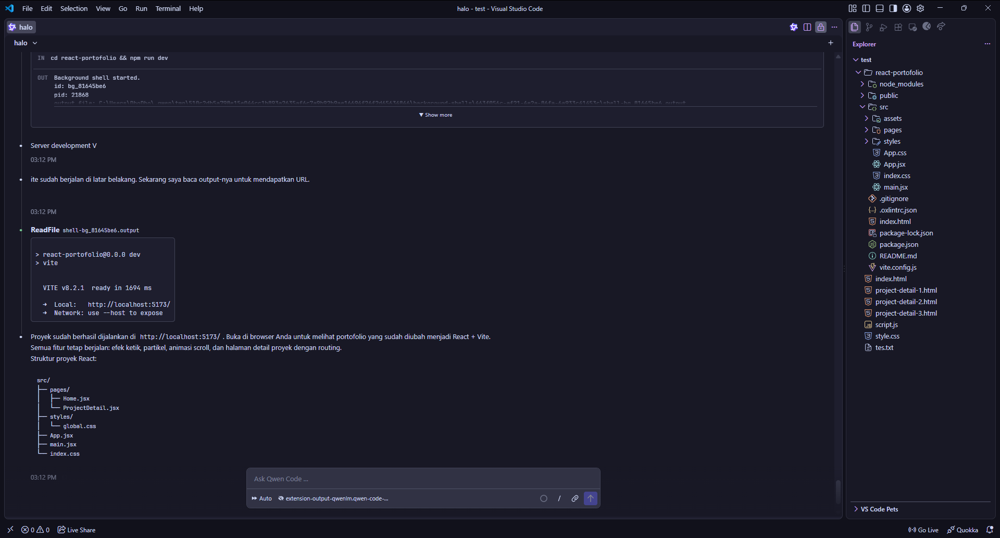

<div align="center">

# DeepSeek Web Agentic Gateway for Qwen Code

### An OpenAI-compatible gateway that connects Qwen Code to DeepSeek Web for agentic coding workflows while keeping tool execution under Qwen Code’s control

[](pyproject.toml)
[](app/server.py)
[](Dockerfile)
[](README.md#tests)
[](LICENSE)

<p>
  <strong>Qwen Code stays in control of your tools.</strong><br>
  The gateway translates protocols, preserves tool history, and connects the
  OpenAI-compatible API to an isolated DeepSeek Web backend.
</p>

</div>

<p align="center">
  <a href="#quickstart-credential-free-smoke-test">Quickstart</a> ·
  <a href="#using-the-real-deepseek-web-backend">Real backend</a> ·
  <a href="#documentation-map">Documentation</a> ·
  <a href="#security-boundary">Security</a>
</p>

> [!WARNING]
> **Experimental / local-first.** Production-ready scope is limited to local/private deployment and controlled LAN use. Direct public-internet exposure is intentionally out of scope. DeepSeek Web access depends on an unofficial private API path and may break or be rate-limited.
>
> **Terms of Service:** This project is not affiliated with or endorsed by DeepSeek and does not use the official DeepSeek API. It adapts access to `chat.deepseek.com` into an unofficial API. Review and comply with DeepSeek's current Terms of Service, acceptable-use rules, and applicable laws before using it. You are responsible for your account, credentials, requests, and any consequences of use.

## At a glance

|                      |                                                 |
| -------------------- | ----------------------------------------------- |
| **What it is**       | A local OpenAI-compatible gateway for Qwen Code |
| **Primary endpoint** | `POST /v1/chat/completions`                     |
| **Backend**          | DeepSeek Web through an isolated adapter        |
| **Tool executor**    | Qwen Code — never the gateway                   |
| **Default binding**  | `127.0.0.1:8000`                                |
| **Verification**     | `542 passed, 3 deselected` offline suite        |

## Why this project

Qwen Code is the coding agent and tool executor. This gateway translates protocols only:

```text
Qwen Code
   │ OpenAI Chat Completions + tools
   ▼
DeepSeek Qwen Gateway
   │ canonical history, streaming, emulated tool envelope
   ▼
DeepSeek Web backend
```

The gateway never reads or edits the user's repository and never executes shell/filesystem tools. Qwen Code executes those tools and sends the results back.

## Highlights

<table>
<tr>
<td width="50%">

### Protocol

- OpenAI-compatible `POST /v1/chat/completions`
- `GET /v1/models` and streaming SSE
- Canonical multi-turn conversation state
- Tool-call ID preservation across turns

</td>
<td width="50%">

### Reliability

- Prompt-emulated tool calling
- Bounded repair and transport retry
- Account routing and session failover
- Secret-aware diagnostics and masked views

</td>
</tr>
<tr>
<td width="50%">

### Operations

- Self-contained `/admin` dashboard
- `/health` and metrics endpoints
- Docker Compose deployment
- Non-root runtime image

</td>
<td width="50%">

### Evidence

- Deterministic acceptance fixture
- Offline protocol regression suite
- Qwen Code wire fixtures
- Deployment artifact tests

</td>
</tr>
</table>

## Current status

- M0–M13 implementation milestones are present.
- Offline regression suite is the primary reproducible verification path.
- M8 manual coding acceptance is **reported successful**: Qwen Code executed real shell/background and file tools through the gateway. The repository still treats the offline suite as the primary reproducible verification path.
- The upstream DeepSeek Web integration is experimental and credential-dependent.

## Agentic coding evidence

The following operator-provided screenshot records a manual Qwen Code session using
DeepSeek Web through the gateway while executing coding-agent tools, including
background shell and file operations. It is supplementary visual evidence, not a
replacement for the reproducible offline test suite.

<p align="center">
  
</p>

<p align="center"><em>Manual acceptance evidence: Qwen Code remains the tool executor while the gateway provides the DeepSeek Web backend.</em></p>

## Quickstart: credential-free smoke test

Requirements: Python 3.12+ and a virtual environment.

Create the environment and install the project with development dependencies:

```powershell
py -3.12 -m venv .venv
.venv\Scripts\python.exe -m pip install -e ".[dev]"
copy .env.example .env
```

Set these values in `.env` for a local smoke test:

```dotenv
GATEWAY_BACKEND=fake
GATEWAY_ALLOW_NO_AUTH=1
GATEWAY_HOST=127.0.0.1
```

Then run:

```text
.venv\Scripts\python.exe -m app.main
```

In another terminal:

```powershell
curl.exe http://127.0.0.1:8000/health
```

For a Docker-based local deployment:

```powershell
docker compose up --build
```

The default Compose publication is loopback-only at `http://127.0.0.1:8000`. For real DeepSeek Web usage, set `GATEWAY_BACKEND=deepseek_web`, `DEEPSEEK_AUTH_TOKEN`, and `DEEPSEEK_GATEWAY_API_KEY`. Never commit `.env`, tokens, cookies, or diagnostics captures.

## Using the real DeepSeek Web backend

The gateway uses an unofficial DeepSeek Web authentication path. You need an
account that can access `https://chat.deepseek.com`, and you are responsible
for complying with the service's terms and applicable laws.

To obtain the DeepSeek Web token used by the backend:

1. Sign in to `https://chat.deepseek.com` in your browser.
2. Open the browser developer tools console for that site.
3. Read the token from the site's authenticated local storage using the method
   documented by the vendored upstream client:

   ```javascript
   JSON.parse(localStorage.getItem("userToken")).value;
   ```

4. Copy the value directly into your private `.env` as
   `DEEPSEEK_AUTH_TOKEN=...`. Do not paste it into GitHub, issues, logs, or
   chat. If the site changes its storage format, consult the upstream notes
   and verify the current client behavior before using a token.

Generate a separate random value for `DEEPSEEK_GATEWAY_API_KEY`. This key is
for Qwen Code to authenticate to the local gateway; it is not the DeepSeek
token. Cookie files are optional and only needed when the upstream requires
Cloudflare clearance. Treat them as credentials and keep them outside the
repository.

For a real run, use either native Python or Docker after setting at least:

```dotenv
GATEWAY_BACKEND=deepseek_web
DEEPSEEK_AUTH_TOKEN=<private-deepseek-web-token>
DEEPSEEK_GATEWAY_API_KEY=<private-local-gateway-key>
GATEWAY_ALLOW_NO_AUTH=0
GATEWAY_HOST=127.0.0.1
```

Native process:

```powershell
.venv\Scripts\python.exe -m app.main
```

Docker Compose:

```powershell
docker compose up -d --build
docker compose ps
```

Check readiness with `curl.exe http://127.0.0.1:8000/health`. See
[`docs/OPERATIONS.md`](docs/OPERATIONS.md) for lifecycle commands, admin
authentication, diagnostics, volumes, and troubleshooting.

## Qwen Code configuration

Use the API root, not the chat-completions path:

```text
baseUrl: http://127.0.0.1:8000/v1
model: deepseek-web
```

See [`docs/QWEN_CODE_INTEGRATION.md`](docs/QWEN_CODE_INTEGRATION.md) for the provider configuration and the M8 checklist. See [`docs/OPERATIONS.md`](docs/OPERATIONS.md) for Docker.

## Tests

```powershell
.venv\Scripts\python.exe -m pytest -q
```

Live tests are excluded by default and require credentials. CI runs the offline suite and deployment artifact tests; it does not claim live DeepSeek acceptance.

## Documentation map

- [`docs/OPERATIONS.md`](docs/OPERATIONS.md) — Docker/native startup, lifecycle, admin access, diagnostics, volumes, and troubleshooting.
- [`docs/QWEN_CODE_INTEGRATION.md`](docs/QWEN_CODE_INTEGRATION.md) — Qwen Code provider configuration, OpenAI-compatible base URL, and acceptance checklist.
- [`docs/API_CONTRACT.md`](docs/API_CONTRACT.md) — public endpoints, request/response shapes, streaming, retries, and tool-call history.
- [`docs/ARCHITECTURE.md`](docs/ARCHITECTURE.md) — gateway boundaries and component design.
- [`docs/TOOL_CALLING_PROTOCOL.md`](docs/TOOL_CALLING_PROTOCOL.md) — prompt-emulated tool envelope and validation rules.
- [`docs/SECURITY.md`](docs/SECURITY.md) — threat model, credential handling, logging, network exposure, and tool-execution boundary.
- [`docs/TEST_PLAN.md`](docs/TEST_PLAN.md) — offline and live verification strategy.
- [`docs/PROGRESS.md`](docs/PROGRESS.md) and [`docs/ROADMAP.md`](docs/ROADMAP.md) — milestone history and planned direction.
- [`docs/DECISIONS.md`](docs/DECISIONS.md) — architectural decisions and trade-offs.
- [`SECURITY.md`](SECURITY.md) — public vulnerability-reporting policy.

## Security boundary

Native defaults bind to loopback. `/v1/*` requires the gateway bearer key unless local development explicitly opts into `GATEWAY_ALLOW_NO_AUTH=1`. Admin routes are open only on loopback; when the process bind is non-loopback, all admin reads and account mutations require the gateway bearer key. Use TLS and a separate network boundary before any remote exposure.

Diagnostics are opt-in and contain request bodies. Keep them in a private location and disable them when not needed. See [`SECURITY.md`](SECURITY.md) for vulnerability-reporting guidance.

## Repository map

- `app/` — gateway implementation and backend adapters
- `tests/` — protocol and regression tests
- `acceptance/m8-buggy-repo/` — deterministic fixture for the coding acceptance
- `docs/` — API contract, architecture, security, operations, decisions, and integration notes
- `Dockerfile` / `compose.yaml` — non-root local deployment path

## Third-party attribution

This project uses the vendored transport and proof-of-work components from
[`xtekky/deepseek4free`](https://github.com/xtekky/deepseek4free). Thank you to
Tekky and the upstream contributors for making that work available under the
MIT License. See the preserved upstream license at
[`vendor/deepseek4free/LICENSE`](vendor/deepseek4free/LICENSE) and vendoring
notes in [`vendor/deepseek4free/VENDOR_INFO.md`](vendor/deepseek4free/VENDOR_INFO.md).

## License

MIT. See [`LICENSE`](LICENSE).
